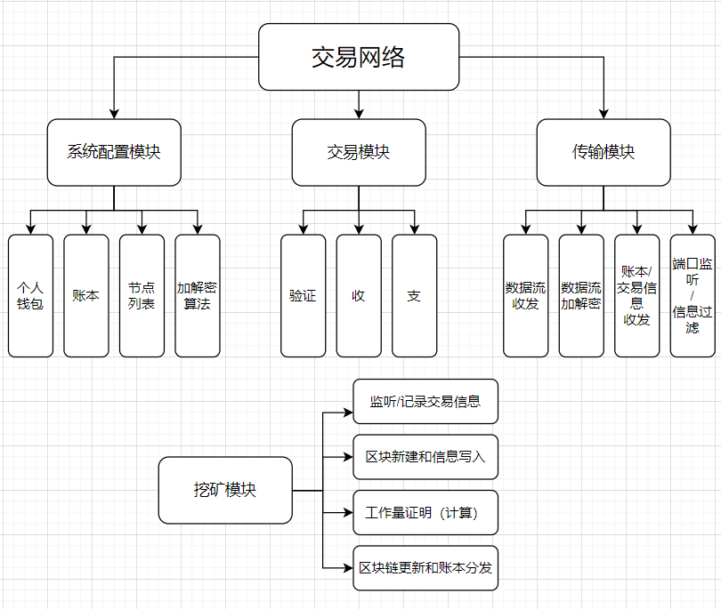
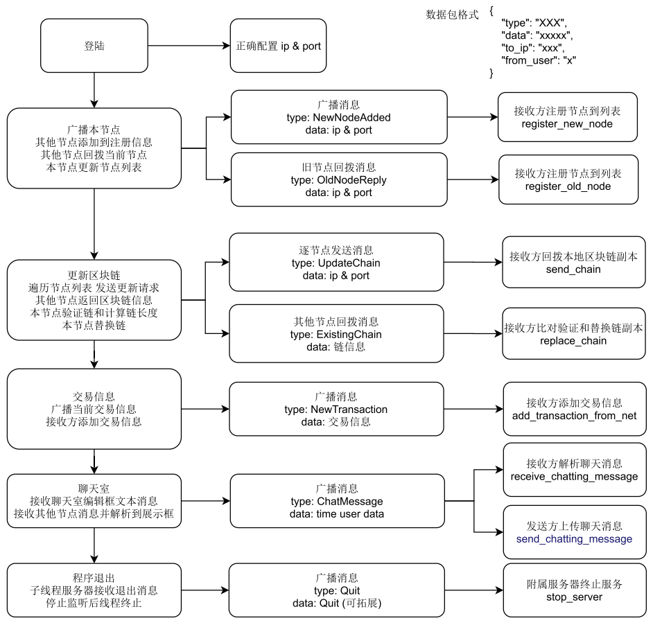
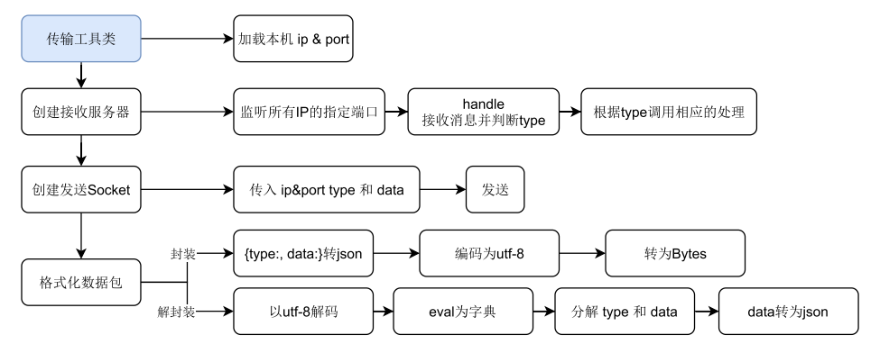
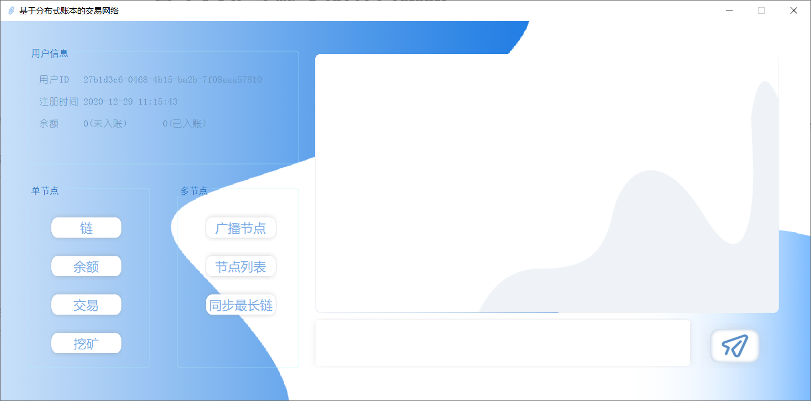
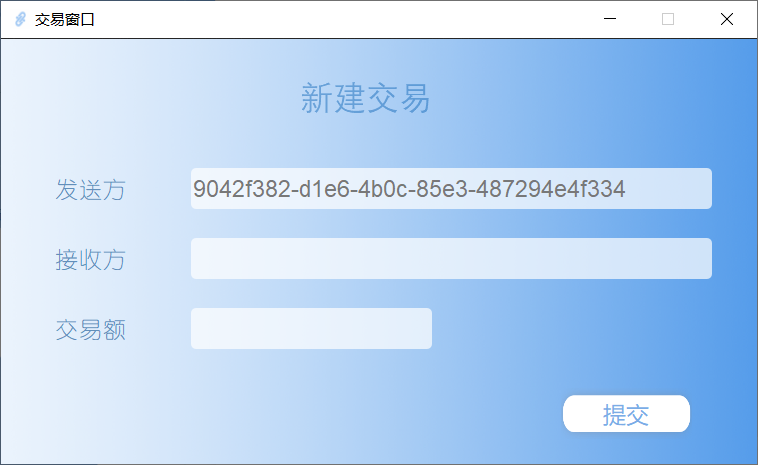

# 基于分布式账本的交易网络

## 软件功能

1. 参考比特币系统，实现**去中心交易网络**。每个人管理自己的钱包，所有交易由账本记录，而账本存放在由众多节点组成的去中心网络。
2. 目前已实现**查看链**（账本）、**余额计算**、**节点交易**、**挖矿**（记账）等个体基本交易操作，同时针对多用户多节点网络环境，配置了**节点广播和记录**、**账本同步**的功能，确保同一网络下的各节点顺利交易
3. 另外，对传输层进行拓展，实现了**集体聊天室**功能，网络中各节点可以在软件内进行文本信息交流
4. 考虑到用户信息保密保护，对传输层数据增设了初步的DES**加密模块**，并且根据实际需要后续**可拓展**应用其它加密算法

## 模块设计

- 总体结构

  

- 多节点逻辑处理流程

  

- 传输模块

  

- 数据加密模块

  

## 界面布局

- 主界面

  

  - 用户信息
    - 用户ID：当前用户在本网络中的**唯一标识**
    - 注册时间
    - 余额：分为**已入账**（已经记录到**区块**中，不能轻易改变，可信度高）、**未入账**（另外包含了**交易池**的交易记录，等待写入账本。可信度相对不高）
  - 单节点
    - 链：查看当前区块链记录，即查看账本
    - 余额：遍历账本和交易池，计算并更新用户余额
    - 交易：呼出交易窗口，新建一笔交易
    - 挖矿：根据内置算法，计算区块hash取得工作量证明，获取系统奖励；挖取到的新区块会被添加到当前节点的链上，等待其他节点同步
  - 多节点
    - 广播节点：将当前节点的IP地址**广播**到网络中，其他节点接收到数据会注册本节点，并**回拨**其IP到本节点
    - 节点列表：查看当前已注册的节点和用户，其中内置用户"0"为系统，用户“Test”作测试使用
    - 同步最长链：广播消息到网络，请求其它节点发送链信息，接收到回拨信息后进行比对验证和替换
  - 信息输出框：展示必要系统操作状态和聊天信息
  - 聊天编辑框和发送按钮：支撑聊天室功能

- 交易窗口

  

  - 填写交易信息和提交交易记录，交易记录会广播到当前网络，其他节点接收后录入其交易池
  - 其中发送方固定为当前用户ID，接收方为节点列表内以记录的用户

## 使用流程

1. 解压软件包，共两个文件`config.json`、`Blockchain_app.exe`，放在同一目录下

2. 连接指定热点或WiFi，查看本机IP，将IP地址填入`config.json`的`"ip":`，替换已有配置后保存文件并退出；端口号默认不变

   ```json
   {
       "ip": "Your IP Address",
       "port": 9527
   }
   ```

3. 双击运行`Blockchain_app.exe`，打包封装后启动速度较慢，稍等一分钟

4. 主页面出现后，为保证体验顺利，请先点击“**广播节点**”按钮以注册节点到网络

5. 后续即可自行操作